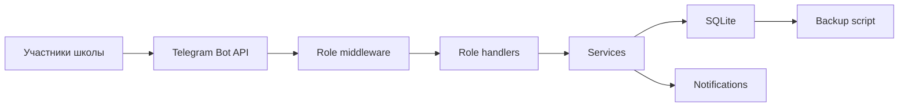

<h1 align="center">MindSpark</h1>

<p align="center">Telegram-платформа для школы, учебного центра или команды репетиторов</p>

<p align="center">
  
  
  
  
  
</p>

## О проекте

MindSpark автоматизирует работу образовательного бизнеса внутри Telegram. Ученики записываются на курсы и получают задания, родители контролируют обучение, преподаватели ведут занятия, а администрация управляет пользователями, расписанием и оплатой.

Проект подходит как основа для онлайн-школы, учебного центра или частной команды преподавателей.

## Возможности

- четыре роли: ученик, родитель, преподаватель и администратор;
- групповые и индивидуальные курсы;
- расписание, лимиты мест, запись и отмена;
- разовые платежи и абонементы;
- загрузка и ручная проверка чеков;
- автоматическая активация оплаченного курса;
- связь профилей родителей и учеников;
- домашние задания и объявления;
- массовые рассылки;
- административная панель со статистикой;
- резервное копирование SQLite;
- Docker healthcheck и автоматический перезапуск.

## Технологии

| Компонент | Технология |
|---|---|
| Telegram-интерфейс | aiogram 3.7 |
| Хранилище | SQLite + aiosqlite |
| Healthcheck | aiohttp |
| Конфигурация | python-dotenv |
| Развёртывание | Docker Compose |
| Тестирование | pytest |

## Архитектура



## Структура проекта

```text
mindspark_bot/
├── handlers/       # сценарии ученика, родителя, преподавателя и администратора
├── keyboards/      # Telegram-меню
├── middlewares/    # роли и ограничение частоты запросов
├── services/       # уведомления и бизнес-сервисы
├── database/       # модели и запросы SQLite
├── states/         # FSM-состояния
├── config.py       # настройки окружения
└── main.py         # точка входа и healthcheck

tests/              # тесты базы данных
scripts/backup.sh   # согласованная резервная копия
compose.yaml        # production-запуск
```

## Быстрый запуск через Docker

```bash
git clone https://github.com/loLy69/st-bot.git mindspark
cd mindspark
cp mindspark_bot/.env.example .env
```

Заполните `.env` реальными значениями, затем:

```bash
docker compose up -d --build
docker compose logs -f bot
```

Проверка состояния:

```bash
curl http://127.0.0.1:8080/health
```

## Локальная разработка

```bash
python -m venv .venv
pip install -r requirements.txt
pytest
cd mindspark_bot
python main.py
```

## Переменные окружения

| Переменная | Назначение |
|---|---|
| `BOT_TOKEN` | токен от BotFather |
| `ADMIN_IDS` | Telegram ID администраторов через запятую |
| `DB_PATH` | путь к SQLite, в Docker `/app/data/mindspark.db` |
| `SCHOOL_NAME` | название школы |
| `SUPPORT_USERNAME` | username поддержки без `@` |
| `PAYMENT_DETAILS` | инструкция и реквизиты оплаты |
| `TIMEZONE` | часовой пояс |
| `PORT` | порт healthcheck |

Файл `.env` и база данных не должны добавляться в Git.

## Развёртывание и backup

База хранится в постоянном Docker volume `mindspark_data`. Скрипт `scripts/backup.sh` использует SQLite backup API и хранит архивы 14 дней.

```bash
sh scripts/backup.sh
git pull --ff-only
docker compose up -d --build
```

## Безопасность

- администраторы определяются только через `ADMIN_IDS`;
- заявки преподавателей требуют ручного одобрения;
- роли проверяются middleware и обработчиками;
- секреты и пользовательская база исключены из Git;
- правила обработки персональных данных должны быть согласованы перед production-запуском.

## Ограничения текущей версии

- одна образовательная организация на экземпляр;
- SQLite рассчитан на умеренную нагрузку;
- платежи подтверждаются вручную по чеку;
- отдельная веб-панель отсутствует;
- CI пока не настроен.

## Возможности развития

- PostgreSQL и SQLAlchemy;
- веб-панель администрации;
- интеграция с CRM и платёжным провайдером;
- календарная синхронизация;
- расширенные отчёты и аналитика;
- GitHub Actions CI и мониторинг.

## Контакты

- Дмитрий — Telegram: [@nigGats9](https://t.me/nigGats9)
- Виктория, менеджер проекта — [viculence@yahoo.com](mailto:viculence@yahoo.com)
